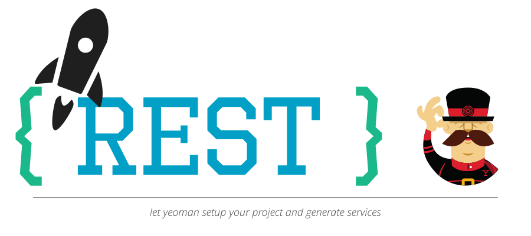

# generator spring rest commons




Scaffold your spring-boot application and generate services. The generated code is based on [rocketbase-io/commons-rest](https://github.com/rocketbase-io/commons-rest).

## Usage

```bash
# installation
npm install -g yo
npm install -g generator-spring-rest-commons
# usage
yo generator-spring-rest-commons
```

